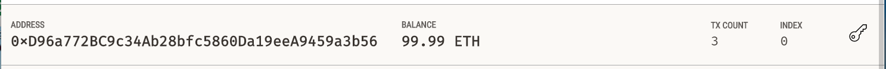
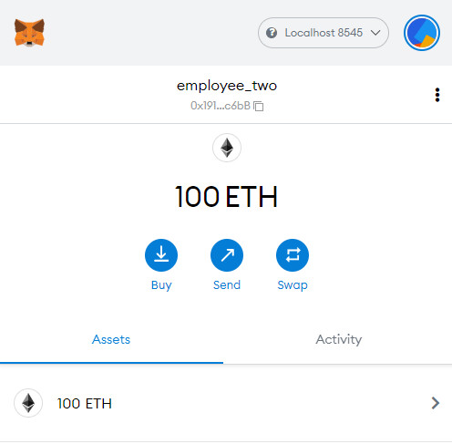

# Associate Profit Splitter
Looks like we've made our first contract...

## Instructions

This assignment has three levels of difficulty, with each contract increasing in complexity and capability. Although it is highly recommended you complete all three contracts, you are only required to solve one of the three contracts. Recommended to start with Level 1, then move forward as you complete the challenges.

* **Level One** is an `AssociateProfitSplitter` contract. This will accept Ether into the contract and divide the Ether evenly among the associate level employees. This will allow the Human Resources department to pay employees quickly and efficiently.

### Level One: The `AssociateProfitSplitter` Contract

## Test the contract - Employees Paid a total of 40ETH

Company Account used to pay the employees:

Employee One, Two and Threes accounts (Pre Payment):

Company Account after paying the employees:

Employee One, Two and Threes accounts (Post Payment):

___
Here are the Employees Metamask accounts Pre and Post payment

